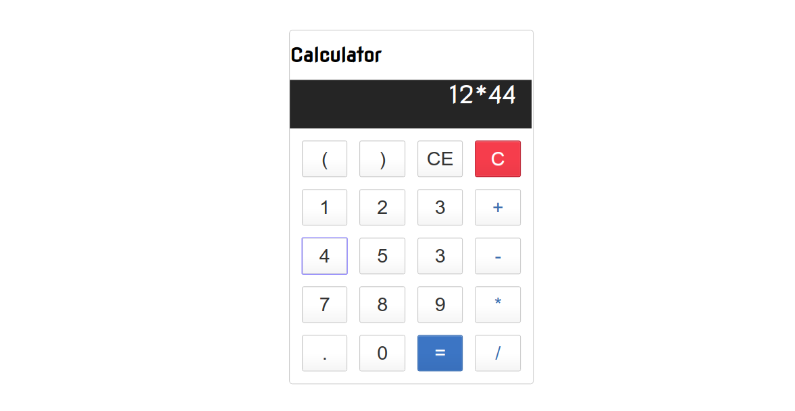

# Basic Calculator
This is a basic calculator written in React. Happy hacking.

### Screenshot

### Notes

Some of the react topics covered  and additional Javascript stuff learnt are :

* Components
* props
* states
* eval() function

### Running the program

Open the index.html file in a web browser preferably the modern ones.

## Acknowledgement

Many thanks to [Nitin Patel](https://medium.com/@nitinpatel_20236/how-to-build-a-simple-calculator-application-with-react-js-bc10a4568bbd) for his great article.