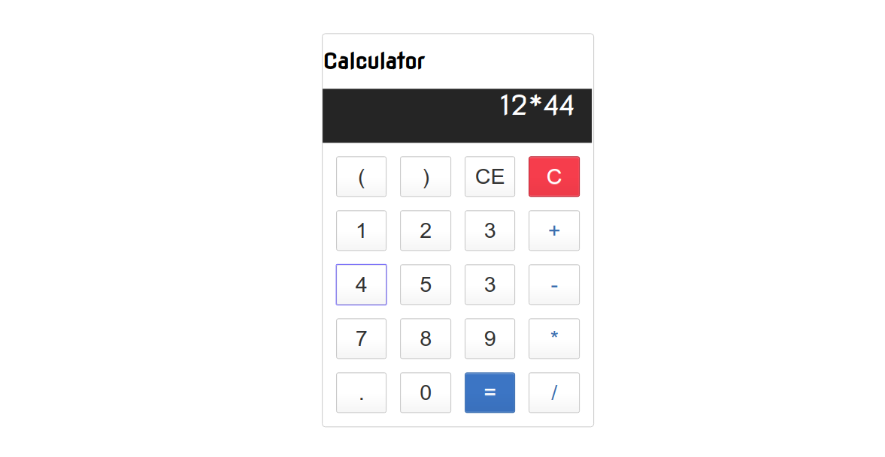

# Basic Calculator
This is a basic calculator written in React. Happy hacking.

### Screenshot



### Notes

Some of the react topics covered  and additional Javascript stuff learnt are :

* Components
* props
* states
* eval() function

### Installation
You can install the necessary dependecies by following steps bellow:

```sh
$ git clone https://github.com/MuhiaKevin/React-Calc.git
$ cd React-Calc
$ npm install
```

### Running the program
Run the following command to download a torrent file

Example :
```sh
$ npm start
```


## Acknowledgement

Many thanks to [Nitin Patel](https://medium.com/@nitinpatel_20236/how-to-build-a-simple-calculator-application-with-react-js-bc10a4568bbd) for his great article.